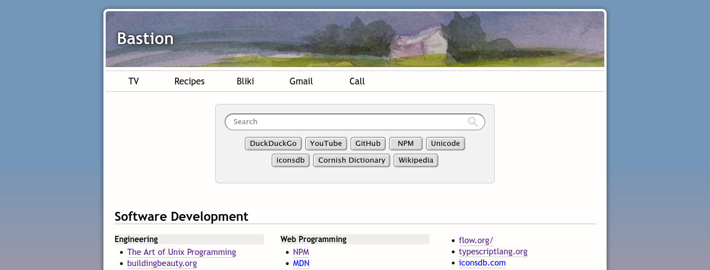

## Bastion

An information repository. Made and curated by humans, for humans.



Hosted at https://bastionhome.github.io

## Development

This repo was generated from the template [benchristel/preact-typescript-vite-taste](https://github.com/benchristel/preact-typescript-vite-taste).

### Setup

After cloning this repo, run the one-time setup script to install dependencies and git hooks:

```
yarn setup
```

### Server and Typechecker

```
yarn dev
yarn ts
```

- Opening the project in **Visual Studio Code** automatically starts the dev server and `typescript` typechecker.
- The dev server runs at http://localhost:5173 (the port number is `vite` in 1337... sort of).
- Output appears in the terminal pane (accessed via `ctrl+~`).
- Type errors also show up in the problems pane (`ctrl+shift+M`).
- The server and typechecker stop automatically when VS Code quits.

### Tests

http://localhost:5173

- **Tests** run in the browser. The test report appears at the top of the screen.
- The page will refresh (re-running the tests) whenever you save a file.
- The tests and test report are completely removed from production builds.

### Formatting

- Files get auto-formatted when you commit, so you'll never check in inconsistently-formatted code. To disable this behavior, delete `.husky/pre-commit`.
- To format all files, run `yarn format`.
- The code formatter is `prettier`. See `.prettierrc` for configuration.

### Building for production

```
yarn build
```

To smoketest your production build before deploying it, I recommend installing `serve`:

```
yarn global add serve
serve dist
```

You can then view your app at http://localhost:3000.

### Deploying

To deploy your built app to GitHub Pages, go to the `Pages` tab of your repo's settings and change the directory to deploy from to `/docs`.
